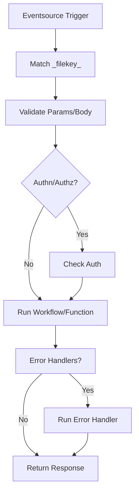

In Godspeed, every API is defined as an event, and handled by a corresponding function. This unified event-driven structure works for both REST and non-REST event sources (HTTP, WebSocket, Kafka, etc.).

This guide explains how to write new APIs in three clear steps:

## Define API Schema (give all event examples)

To write an api in Godspeed, first you need to write an Event Schema. This schema is a structured YAML configuration that follows the OpenAPI specification, allowing you to define every detail of how the event should behave. All events adhere to a standard structure, which is one of the core design principles of Godspeed, regardless of their source or protocol.

An event schema specifies:

- The name/topic/URL of the event
- The event handler Workflow (fn)
- Input and Output schema
- [Validation error handling](/docs/microservices-framework/event-sources/validations/schema-validation)
<!-- - [Authorization checks](/docs/microservices-framework/authorization/overview.md) -->

Godspeed follows [Schema Driven Development & Single Source of Truth](../microservices-framework/introduction/guard-rails.md#1schema-driven-development), [Configure Over Code](../microservices-framework/introduction/guard-rails.md#2configure-over-code) and [Modular Architecture](../microservices-framework/introduction/guard-rails.md#4-decoupled-architecture).

The meta-framework follows a generic schema for defining events - their inputs, outputs, swagger specs, with validations, authentication, authorization etc.

```yaml
http.get./greet: #The initial line depicts a fusion of the event, the employed method, and the path associated with the event.
  fn: function_greet #Required. The 'fn' key receives the function name located in 'src/functions' and forwards the accompanying parameters.

  #optional configurations
  #Swagger components
  body: #same as requestBody in Swagger world
  params: #same as swagger `parameters` schema
  responses: #same as swagger `responses` schema
  id: # swagger. if not provided, when generating swagger, this is generated from the URI of the event by default
  operationId: # swagger if not provided, check if `id` is set. If that is also not set, use the summary to generate the operationId
  summary:
  tags: # swagger if you give `tags` array in schema of event, framework uses that to add tags to your generated spec. Else it uses the path and name of the file containing the event as tags. For ex. <folder_name>_<file_name>

  #Other non-swagger components (optional)
  authn: #custom authentication. Currently plugins support JWT. Can be customized
  authz: #your custom authz workflow
  on_request_validation_error: #when validation fails
  on_response_validation_error: #when validation fails
  log: #Open Telemetry compliant log attributes which help debug and search through logs better
    attributes:
```

`http`: Protocol http eventsource (can be any)

`get` : method (depends on the eventsource used. Can be topic for Kafka)

`/helloworld`: endpoint (In case of http and graphql sources. Can be groupId in case of Kafka for ex.)

We are exposing an endpoint with a `get` method on `http` protocol. This endpoint is calling an eventhandler called `helloworld` in the second line. Event handlers can be functions written in typescript, javascript or yaml workflows in Godspeed's DSL format. In the above example the helloworld function exists in `src/functions` directory.

When switching between eventsources, the event schema undergoes significant changes.

- The first line is changed for each protocol:

In the case of sync events or HTTP events, the start line includes the eventsource name, method, and path.

However, for async events, the start line combines the source name, topic and group ID (for Kafka), or schedule (for Cron).

- Async events like Kafka do not have responses, authentication and authorization fields in schema.

- Cron events do not have any input.

#### Example HTTP Schema

```yaml
http.get./greet: #The initial line depicts a fusion of the event, the employed method, and the path associated with the event.
  fn: function_greet #The 'fn' key receives the function name located in 'src/functions' and forwards the accompanying parameters.
  on_request_validation_error: on_request_validation
  params: #It is also possible to define inputs such as 'params,' 'body,' 'headers,' and 'query parameters.'
    - name: greet_message
      in: query
      required: true
  body:
    content:
      application/json:
        schema:
          type: object
          properties:
            name:
              type: string
  responses:
    500:
      content:
        application/json:
          schema:
            type: object
    200:
      content:
        application/json:
          schema:
            type: object
```

## Authentication using JWT

**JWT (JSON Web Token)** is a standard method for securely transmitting information between two parties as a JSON object. It's commonly used for authentication and authorization in web applications.
In Godspeed, you can easily implement JWT authentication to protect routes, control access to resources and ensure secure API communication.
Currently supported event sources which can leverage this mechanism are:

1. Express
2. Apollo GraphQL
3. Fastify

To Learn more about JWT and Payload [Click Here](/docs/microservices-framework/authentication/jwt)

### How JWT Authentication Works in Godspeed

When a client makes a request to a protected route, they need to include a valid JWT in the request header.
The server validates the token, extracts the payload, and grants access to the resource if the token is valid.
In the case of an expired or invalid token, the client will receive a `401 Unauthorized` response.

:::tip Note
In our Express eventsource plugin, JWT Authentication is implemented using passport-jwt which is a strategy for authenticating with a JSON Web Token. To know more about, you can check [passport documentation](https://www.passportjs.org/)
:::

### Setup and implementation of JWT authentication in Godspeed.

### Step 1: Setting up Environment

**1.** In Godspeed, any configuration which includes secrets or passwords is recommended to be defined using environment variables only. For this, open custom-environment-variables.yaml file which is placed under `config/` in your root project directory and add your jwt configs there like:

```
jwtSecret: JWT_SECRET
audience:  JWT_AUDIENCE
issuer: JWT_ISSUER

```

**2.** Now, you need to export these variables in environment. This can be done in two ways:

**(a)** Set environment variables in .env file which is under your project's root folder /.env as shown below:

```
  JWT_SECRET= mysecret            #the secret
  JWT_AUDIENCE= godspeedsystemms  #aud in jwt token
  JWT_ISSUER= godspeed            #iss in jwt token

```

**(b)** Export these variables to your environment, follow the below syntax to export, based on the shell, you are using:

<details>
<summary> For git bash  </summary>

```bash
   $ export JWT_SECRET=mysecret
   $ export JWT_ISS= mycompany
```

</details>

<details>
<summary> For windows powershell  </summary>

```bash
 $env:JWT_SECRET= "mysecret"
 $env:JWT_ISS= "mycompany"
```

</details>

After exporting the environment variable, you can access these variable anywhere in your project by using inline
scripting `<%config.issuer%>` in yaml or as `ctx.config.issuer` in js/ts workflows.

:::tip Note
If you do not set these environment variables mentioned above, it will result in an error while running your project. And if the token values set in header differ from those specified in the configuration, the response will be 'Unauthorized.'
:::

### Step 2: Enable JWT Auth in your project's eventsource configuration file.

JWT configuration is written under authn: in the event source's configuration file. For Express, config file name will be http.yaml. Open this file and Set up jwt authn as shown below.

`src/eventsources/http.yaml`

```
type: express
port: 4000
#auth settings to run by default on every event
authn:
  jwt:
    secretOrKey: <% config.jwtSecret %> # to access jwtSecret from config
    audience: <% config.audience %>
    issuer: <% config.issuer %>
```

Once you have enabled it here, authentication will be true for all endpoints, unless you explicitly set authn:false in their event schema.

### Disabling JWT Authentication at Event Level

The plugins follow zero trust policy as a first principle, so if you have setup jwt spec at event source level, authentication for all the events will be true by default, unless you explicitly set authn:false in their event schema.
If you don't want users to be authenticated, you can disable any end-point by writing authn: false in your event schema like this:

```
http.get./helloworld:
  fn: helloworld
  authn: false
  params:
    - name: name
      in: query
      required: true
```

### User Login Example using JWT Authentciation

**Event**

```yaml
# Login with username and password
http.post./login: # defines the POST request that will be triggered when a client hits /login endpoint.
  fn: verifyLogin # the workflow to handle the request
  authn: false
  body:
    content:
      application/json:
        schema:
          type: object
          properties:
            username:
              type: string
            password:
              type: string
          required:
            - username
            - password
  responses:
    "200":
      description: "Login successful"
      content:
        application/json:
          schema:
            type: object
    "401":
      description: "Invalid credentials"
      content:
        application/json:
          schema:
            type: string
            example: "Invalid username or password"
```

**Workflow (verifyLogin.ts)**

```ts
import {
  GSCloudEvent,
  GSContext,
  PlainObject,
  GSStatus,
  logger,
} from "@godspeedsystems/core";
import jwt from "jsonwebtoken";
export default function (ctx: GSContext) {
  const {
    inputs: {
      data: { body },
    },
  } = ctx;
  logger.info("user info received %o", body);
  // Dummy user validation (replace with your authentication logic)
  if (body.username === "user" && body.password === "password") {
    // Create a JWT token
    const token = jwt.sign(
      { sub: "1234567890", name: "John Doe", role: "user" }, // Payload
      ctx.config.jwtSecret, // access Secret key from config
      {
        expiresIn: "1h",
        issuer: ctx.config.issuer,
        audience: ctx.config.audience,
      } // jwt Options
    );
    logger.info("Token generated %s", token);
    return new GSStatus(true, 200, "Login Successful", { JWT: token }, {});
  } else {
    return new GSStatus(true, 401, "Failed", "Invalid Credentials", {});
  }
}
```

### How to access JWT payload

You can access the complete JWT payload in `<% inputs.user %>` in YAML workflows, and as ctx.inputs.data.user when writing JS/TS workflows.

Example access from TS workflow

```ts
import {
  GSCloudEvent,
  GSContext,
  PlainObject,
  GSStatus,
  logger,
} from "@godspeedsystems/core";
export default function (ctx: GSContext) {
  const {
    inputs: {
      data: { user },
    },
  } = ctx;

  return new GSStatus(true, 200, "Ok", { "Payload user": user }, {});
}
```

### Standardized JWT Configuration (For Plugin Creators)

For consistency across plugins, it's recommended to use a standardized configuration format for JWT settings (issuer, audience, secret key) in eventsources/<plugin_name/>.yaml.

## Authentication using oauth2

## Introduction

OAuth2 is a widely adopted authorization framework that provides a secure and efficient way for users to grant third-party applications access to their data without revealing their credentials. By leveraging OAuth2, Godspeed simplifies the authentication process for both developers and users. OAuth2 offer the ability to connect with authentication providers such as Google, Github and Linkedin.

### How It Works:

1. **User Signup/Signin:** When a user want to signup with google/github/linkedin, express-eventsource will trigger OAuth2 authentication flow.
2. **Redirect to Provider:** The user is redirected to the chosen authentication provider (Google, LinkedIn, or GitHub) to authorize the application.
3. **Authorization Grant:** The provider grants the application an authorization code.
4. **Token Exchange:** The application exchanges the authorization code for an access token.
5. **User Information Retrieval:** The application uses the access token to retrieve the user's information from the provider's API.
6. **Authentication Success:** Once the user's identity is verified, they are logged in to the platform.

## Getting Started:

To start using OAuth2 authentication in your Godspeed project, follow these steps:

### 1. Configure Provider:

Set up your OAuth2 application with the chosen authentication provider (Google, LinkedIn, or GitHub) to obtain the necessary client ID and client secret.

### 2. Set up Environment Variables:

Open .env file in your project's root directory.
Add the following lines, replacing the placeholders with your actual GitHub credentials:

```
  GITHUB_CLIENT_ID= "your_client_id"
  GITHUB_CLIENT_SECRET= "your_client_secret"
  GITHUB_CALLBACK_URL= "your_callback_url" e.g http://localhost:4000/auth/github/callback
  GITHUB_AUTH_ROUTE  =  "/auth/github"
  GITHUB_CALLBACK_ROUTE = "/auth/github/callback"
  GITHUB_SUCCESS_REDIRECT_URL = "/verify/user"
  GITHUB_FAILURE_REDIRECT_URL = "/error"
  # Session Secret
  SESSION_SECRET = "your_secret"
```

### 3. Configure your eventsource

Here's an example of OAuth2 configuration inside (src/eventsources/http.yaml):

```
authn:
  oauth2:
    github:
      client_id: <% process.env.GITHUB_CLIENT_ID %>
      client_secret: <% process.env.GITHUB_CLIENT_SECRET %>
      callback_url: <% process.env.GITHUB_CALLBACK_URL %>
      callback_route: <% process.env.GITHUB_CALLBACK_ROUTE %>
      auth_route: <% process.env.GITHUB_AUTH_ROUTE %>
      success_redirect: <% process.env.GITHUB_SUCCESS_REDIRECT_URL %>
      failure_redirect: <% process.env.GITHUB_FAILURE_REDIRECT_URL %>
```

Let's See an example event and workflow of above provided success_redirect_url

Event src/events/helloUser.yaml

```yaml
http.get./verify/user:
  fn: helloUser
  authn: false
  responses:
  200:
    content:
      application/json:
        schema:
          type: string
```

Workflow (src/functions/helloUser.ts)

```ts
import {
  GSCloudEvent,
  GSContext,
  PlainObject,
  GSStatus,
} from "@godspeedsystems/core";
export default function (ctx: GSContext) {
  const {
    inputs: {
      data: { user },
    },
  } = ctx;
  const name = user.username || user.displayName;
  return new GSStatus(true, 200, "OK", "Hello " + name, {});
}
```

If your auth_route = '/auth/github', hit localhost:4000/auth/github, it will take you to your chosen provider's authorization page i.e. Github in this case.
After authenticating the user successfully, it will redirect to the success_redirect_url i.e '/verify/user' in this case.

## Authentication using oauth2

## Authorization

Authorization is a crucial component of access control, determining who can access what resources and perform specific actions.

### Two types of Authorization

### Role-Based Access Control (RBAC)

RBAC is a widely-used authorization model where access is granted based on predefined roles. Users are assigned roles, and these roles dictate the permissions associated with accessing resources and performing actions.

### Attribute-Based Access Control (ABAC)

ABAC is a dynamic authorization model that considers various attributes associated with **users, resources, actions, and context**. Policies are defined based on these attributes, allowing for more granular control over access. **ABAC is a superset of RBAC**

### Key Agents in Authorization

Authorization involves four key agents:

a. **User**
Users are entities seeking access to resources or the ability to perform actions within a system.

b. **Resource**
Resources are entities or data within a system that users may want to access or manipulate.

c. **Action**
Actions define the specific operations or activities that users may want to perform on resources.

d. **Context**
Context refers to the circumstances or conditions under which a user's request for access is evaluated. This includes factors such as time, location, or any other relevant contextual information.

### Workflow DSL

You can add authorization workflow at the task level in any workflow. The authorization workflow should return allow/deny or json output to the main worklfow.

**Allow/Deny**
If authz workflow returns data as true/false, it means the task is allowed/denied to get executed.

**JSON output**
If authz workflow returns JSON output then it is merged with args.data of the task for which authz is being executed.

Here is the sample spec:
**Sample workflow calling the authz workflow**

```yaml
summary: Call an API
tasks:
  - id: api_step1
    description: Hit with some dummy data. It will send back same as response
    authz:
      fn: com.jfs.authz
      args: <% inputs %>
    fn: datasource.api.post./anything
    args:
      data: <% inputs %>
```

**Sample authorization workflow `com.jfs.authz`**

```yaml
summary: Authorization workflow
tasks:
  - id: authz_step1
    description: return allow/deny based upon user
    fn: datasource.authz.post./authorize
    args:
      data: <% inputs.body.user %>
  - id: authz_step2
    description: transform response from authz api
    fn: com.gs.transform
    args: |
      <coffee% if outputs.authz_step1.data.code == 200 then {
          success: true
          data: true
      } else if outputs.authz_step1.data.code == 201 then {
          success: true
          data:
            where:
              role: 'USER'
      } else {
          success: false
          data: false
      } %>
```

The authorization workflow should return response in this format to allow/deny:

```yaml
success: true/false
data: true/false/JSON output
```

> When data is returned as false i.e. deny then the framework will send `403 Unauthorized` response.

### Sample DB query call authorization

In DB query call, authz workflow can return JSON output with where clause, include clause etc. which will be merged with the args of the main workflow which is doing DB query.

Here is the sample spec:
**Sample workflow calling the authz workflow**

```yaml
summary: datastore demo
tasks:
  - id: find_user
    description: find users
    authz:
      fn: com.jfs.authz
      args: <% inputs %>
    fn: datasource.mongo.user.findMany
    args:
      data:
        include: <% inputs.body.include %>
        where: <% inputs.body.where %>
```

**Sample authorization workflow `com.jfs.authz`**

```yaml
summary: Authorization workflow
tasks:
  - id: authz_step1
    description: return allow/deny based upon user
    fn: datasource.authz.post./authorize
    args:
      data: <% inputs.body.user %>

  - id: authz_step2
    description: transform response from authz api
    fn: com.gs.transform
    args: |
      <coffee% if outputs.authz_step1.data.code == 200 then {
          success: true
          data:
            where:
              role: 'USER'
      } else {
          success: false
          data: false
      } %>
```

When authorization workflow `com.jfs.authz` returns `success: true` then its `data` will be merged with the main workflow which is calling the authz workflow.
For example, in the above authz workflow, `data` is returned as:

```yaml
data:
  where:
    role: "USER"
```

This data will be merged with the args.data of the main workflow i.e.

```yaml
args:
  data:
    include: <% inputs.body.include %>
    where: <% inputs.body.where %> # where clause from authz workflow will be merged with this
```

## Reusing Definitions

## Validations

## File Upload

## Define Event Handler Functions (GSContext, GSCloudEvent, GSStatus, Returning from functions)

## Using Datasources inside functions

## Using datasources with caching

# Godspeed Event Schema & Lifecycle

## What is a Godspeed Event?

A Godspeed event is a declarative definition that maps an incoming trigger (HTTP, Kafka, Cron, etc.) to a function or workflow. It is the entry point for all business logic in a Godspeed project.

## Event Schema: Line-by-Line

```yaml
_filekey_:
  key1: http | kafka | cron # Eventsource instance
  key2: GET | POST | ... # HTTP method
  key3: /users # API endpoint path
fn: my_workflow_or_function
params:
  - in: query | path | header
    name: paramName
    schema:
      type: string | integer | array | boolean
    required: true | false
    deprecated: true | false
    description: "Parameter description"
authn: true | false
authz: true | false
on_request_validation_error: customRequestErrorHandler
on_response_validation_error: customResponseErrorHandler
body:
  content:
    application/json:
      schema:
        type: object | string | number | boolean | array
responses:
  "200":
    description: OK
    content:
      application/json:
        schema:
          type: object | array | string
```

### Key Differences from OpenAPI

- Uses a composite `_filekey_` for eventsource, method, and path (not a flat `paths` object).
- Directly references the function/workflow to execute (`fn`).
- Simple booleans for `authn`/`authz` instead of verbose `security` objects.
- Declarative error handler assignment per event.
- Modular, event-centric model.

## Event-to-Workflow Lifecycle

1. **Eventsource receives a trigger** (e.g., HTTP request).
2. **Event is matched** using `_filekey_`.
3. **Parameters and body are validated**.
4. **Authentication/authorization** is checked if enabled.
5. **Workflow/function (`fn`) is executed**.
6. **Error handlers** are invoked if validation or execution fails.
7. **Response is returned** as defined in `responses`.


---

## Real-World Example: Multi-Entity Event & Workflow

```yaml
_filekey_:
  key1: http
  key2: POST
  key3: /process
fn: process_workflow
authn: true
params:
  - in: body
    name: userId
    schema: { type: string }
body:
  content:
    application/json:
      schema:
        type: object
        properties:
          userId: { type: string }
responses:
  "200":
    description: Success
    content:
      application/json:
        schema: { type: object }
```

```yaml
id: process_workflow
tasks:
  - id: fetch_user
    fn: datasource.userdb.getUser
    args:
      userId: <% inputs.body.userId %>
  - id: transform
    fn: com.gs.transform
    args:
      data: <% outputs.fetch_user.data %>
  - id: return
    fn: com.gs.return
    args: <% outputs.transform.data %>
on_error:
  continue: false
  response:
    success: false
    code: 500
    data: "Processing failed"
```

---

## Troubleshooting & FAQ

- **Q: My event isn't triggering.**
  - Check that `_filekey_` matches the incoming event exactly (eventsource, method, path).
- **Q: Validation errors aren't handled as expected.**
  - Ensure `on_request_validation_error` and `on_response_validation_error` point to valid handlers.
- **Q: How do I debug workflows?**
  - Use logging in your functions and leverage the `on_error` block for custom error responses.
- **Q: How do I migrate from OpenAPI?**
  - Map each OpenAPI path+method to a `_filekey_` event, and use `fn` to point to your workflow.

---

## For LLMs and Automation

- Always use `_filekey_`, `fn`, `params`, `body`, `responses` as core keys.
- Reference workflows/functions by name in `fn`.
- Use `<% ... %>` for inline scripting.
- Validate all YAML for required fields.
- Use descriptive, kebab-case IDs for workflows and tasks.
- Keep event keys consistent and unique.
- Provide code snippets for YAML and TypeScript in answers.

---

## Glossary

- **Event:** A trigger definition mapping an eventsource to a function/workflow.
- **Workflow:** A sequence of tasks/functions, defined in YAML or TS.
- **Datasource:** Integration with an external system (API, DB, etc.).
- **Eventsource:** Mechanism for receiving events (HTTP, Kafka, Cron, etc.).
- **Plugin:** Extension for new datasources/eventsources.
- **GSContext:** Execution context for all logic.
- **GSCloudEvent:** Canonical event/request object.
- **GSStatus:** Standard result/response object.
- **GSActor:** User/system actor info.
- **CLI:** Command-line interface for project and plugin management.
- **Subworkflow:** A workflow called from within another workflow.
- **On_error:** Error handling block in workflows.
- **Inline scripting:** Use of `<% ... %>` for dynamic values in YAML.

---

## Event Types: Actionable Examples

### HTTP Event Example (Full)

```yaml
http.post./user:
  fn: create_user
  summary: Create a new user
  body:
    content:
      application/json:
        schema:
          type: object
          properties:
            name: { type: string }
            email: { type: string }
  responses:
    201:
      description: User created
      content:
        application/json:
          schema:
            type: object
            properties:
              id: { type: string }
              name: { type: string }
              email: { type: string }
  authn: true
  authz: true
```

### Kafka Event Example

```yaml
kafka.topic.user-signup.group1:
  fn: handle_user_signup
  summary: Handle user signup event from Kafka
  body:
    content:
      application/json:
        schema:
          type: object
          properties:
            userId: { type: string }
            timestamp: { type: string }
```

### Cron Event Example

```yaml
cron.schedule.0-0-12-*-*:
  fn: daily_report
  summary: Run daily report at noon
```

---

## How to Migrate from OpenAPI: Checklist

- [ ] For each OpenAPI path+method, create a `_filekey_` event in Godspeed YAML
- [ ] Map OpenAPI `operationId` to `fn`
- [ ] Convert OpenAPI `parameters` to `params`
- [ ] Convert OpenAPI `requestBody` to `body`
- [ ] Convert OpenAPI `responses` to `responses`
- [ ] Replace `security` with `authn`/`authz` booleans or workflows
- [ ] Add error handlers as `on_request_validation_error`/`on_response_validation_error`
- [ ] Use `<% ... %>` for dynamic values

---

## Advanced Troubleshooting & Debugging

- **Event not matching:** Double-check `_filekey_` (eventsource, method, path/topic/schedule)
- **Auth errors:** Ensure `authn`/`authz` are set correctly at both eventsource and event level
- **Validation not firing:** Confirm schema structure and error handler references
- **Workflow not found:** Make sure `fn` points to a valid function/workflow in `src/functions`
- **Debugging:** Use `logger` and `childLogger` in TS/JS workflows; add `on_error` blocks in YAML
- **Edge case:** For async events (Kafka, Cron), omit `responses`, `authn`, `authz` as needed

---

## LLM Guidance & Prompt Templates

- **Prompt:** "Generate a Godspeed event YAML for an HTTP POST /order endpoint with JWT auth and a workflow named create_order."
- **Prompt:** "Write a workflow YAML that fetches a user from datasource.mongo.User.findOne and returns the result."
- **Prompt:** "Convert this OpenAPI path to a Godspeed event YAML."
- **Prompt:** "Add error handling to this event for validation failures."

---

## Cross-links

- [Workflows](./workflows/overview.md)
- [Plugins](./plugins/sample-configs.md)
- [Datasources](./datasources/overview.md)
- [Authentication](./authentication/overview.md)
- [Authorization](./authorization/overview.md)
- [Inline Scripting](./inline-scripting/overview.md)

---

## Event Lifecycle Diagram



---

## Best Practices & Anti-Patterns

**Best Practices:**

- Use descriptive, kebab-case IDs for workflows and tasks
- Keep event keys unique and consistent
- Always validate YAML with a linter
- Use `<% ... %>` for dynamic values, but keep logic simple
- Centralize error handling with `on_error` blocks
- Use environment variables for secrets/config

**Anti-Patterns:**

- Duplicating event keys or function names
- Hardcoding secrets in YAML
- Overusing inline scripting for complex logic
- Skipping validation/error handlers

---

## Expanded Glossary

- **_filekey_:** Composite key for eventsource, method, and path/topic/schedule
- **on_request_validation_error:** Handler for input validation errors
- **on_response_validation_error:** Handler for output validation errors
- **childLogger:** Contextual logger for workflow/task
- **Prisma-as-datastore:** Plugin for database access via Prisma
- **Kafka-as-datasource-as-eventsource:** Plugin for Kafka integration
- **Cron-as-eventsource:** Plugin for scheduled events
- **Swagger spec:** Auto-generated API docs from event YAML
- **LLM Prompt:** A template or example for LLMs to generate code/docs

---
