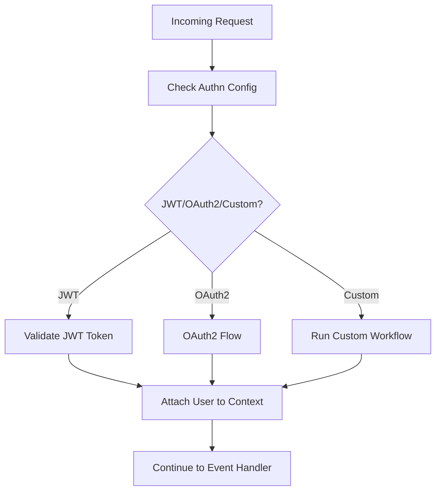

# About Authentication

Authentication is the process of confirming the identity of an individual, system, or entity. It involves verifying that the entity attempting to access a system or resource is indeed who or what it claims to be. In case of the API and event driven architecture realm, we need to know the user who is trying to access the system. _Who is this user?_

Following separation of concerns (or decoupling) as a first principle, the job of authentication and loading the user information is delegated to individual eventsource plugins as part of their native `middleware` capability. Here you may use JWT, Auth0, OAuth2, Keycloak etc. as per your requirement.

The currently supported Express, Fastify and Apollo Graphql [plugins](https://github.com/godspeedsystems/gs-plugins) support JWT and OAuth2 authentication out of the box. In case you need to customize, you can copy the code from our plugins repository and modify that to suit your purpose.

## Actionable Authentication Examples

### JWT Authentication (YAML)

```yaml
authn:
  jwt:
    secretOrKey: <% config.jwt.secret %>
    audience: <% config.jwt.aud %>
    issuer: <% config.jwt.iss %>
```

### OAuth2 Authentication (YAML)

```yaml
authn:
  oauth2:
    github:
      client_id: <% config.github.client_id %>
      client_secret: <% config.github.client_secret %>
      callback_url: <% config.github.callback_url %>
```

### Custom Authentication Workflow (YAML)

```yaml
authn:
  fn: custom_auth_workflow
  args: <% inputs %>
```

### Accessing Authenticated User in TypeScript

```typescript
import { GSContext } from "@godspeedsystems/core";
export default function (ctx: GSContext) {
  const user = ctx.inputs.data.user;
  // Use user info for business logic
}
```

## Troubleshooting & FAQ

- **Q: 401 Unauthorized?**
  - Check JWT/OAuth2 config and environment variables
  - Ensure token is present and valid in request headers
- **Q: Authn not applied?**
  - Confirm `authn` is set at eventsource or event level
- **Q: Custom workflow not called?**
  - Validate `fn` reference and workflow existence

## LLM Guidance & Prompt Templates

- **Prompt:** "Generate a Godspeed JWT authentication config for an Express eventsource."
- **Prompt:** "Show a YAML example for OAuth2 authentication with Google."
- **Prompt:** "Write a TypeScript function that checks the user's role from JWT payload."

## Best Practices & Anti-Patterns

**Best Practices:**

- Use environment variables for all secrets/keys
- Validate tokens and handle errors gracefully
- Use custom workflows for advanced auth logic
- Document all authentication flows

**Anti-Patterns:**

- Hardcoding secrets in YAML
- Skipping token validation
- Ignoring authentication errors
- Duplicating auth logic across eventsources

## Cross-links

- [API & Event](../API%20&%20Event.md)
- [Authorization](../authorization/overview.md)
- [Event Sources](../event-sources/overview.md)
- [Config](../config-and-mappings/config.md)

## Authentication Flow Diagram



## Glossary

- **Authn:** Authentication (identity verification)
- **JWT:** JSON Web Token
- **OAuth2:** Open standard for access delegation
- **Custom Workflow:** User-defined authentication logic
- **User:** Authenticated entity info in context
