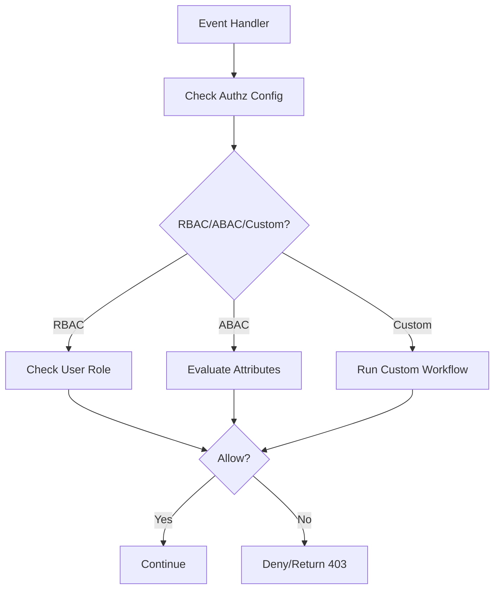

# About Authorization

Authorization is a crucial component of access control, determining who can access what resources and perform specific actions.


## Two types of Authorization

### Role-Based Access Control (RBAC)

RBAC is a widely-used authorization model where access is granted based on predefined roles. Users are assigned roles, and these roles dictate the permissions associated with accessing resources and performing actions.

### Attribute-Based Access Control (ABAC)

ABAC is a dynamic authorization model that considers various attributes associated with **users, resources, actions, and context**. Policies are defined based on these attributes, allowing for more granular control over access. **ABAC is a superset of RBAC**

### Key Agents in Authorization

Authorization involves four key agents:

a. **User**
Users are entities seeking access to resources or the ability to perform actions within a system.

b. **Resource**
Resources are entities or data within a system that users may want to access or manipulate.

c. **Action**
Actions define the specific operations or activities that users may want to perform on resources.

d. **Context**
Context refers to the circumstances or conditions under which a user's request for access is evaluated. This includes factors such as time, location, or any other relevant contextual information.

## Actionable Authorization Examples

### RBAC Example (YAML)

```yaml
authz:
  fn: check_role
  args:
    allowed_roles: ["admin", "editor"]
```

### ABAC Example (YAML)

```yaml
authz:
  fn: abac_policy
  args:
    resource: "document"
    action: "edit"
    attributes:
      department: <% inputs.user.department %>
```

### Custom Authorization Workflow (YAML)

```yaml
authz:
  fn: custom_authz_workflow
  args: <% inputs %>
```

### TypeScript Authorization Check

```typescript
import { GSContext } from "@godspeedsystems/core";
export default function (ctx: GSContext) {
  const user = ctx.inputs.data.user;
  if (user.role !== "admin") {
    throw new Error("Forbidden");
  }
}
```

## Troubleshooting & FAQ

- **Q: 403 Forbidden?**
  - Check allowed roles/attributes in your authz workflow
  - Ensure user info is present in context
- **Q: Authz not applied?**
  - Confirm `authz` is set at event or task level
- **Q: Custom workflow not called?**
  - Validate `fn` reference and workflow existence

## LLM Guidance & Prompt Templates

- **Prompt:** "Generate a Godspeed RBAC authorization config for an API event."
- **Prompt:** "Show a YAML example for ABAC policy on a resource."
- **Prompt:** "Write a TypeScript function that denies access if user is not in a list of roles."

## Best Practices & Anti-Patterns

**Best Practices:**

- Use modular workflows for RBAC/ABAC logic
- Validate all user/resource/action attributes
- Document all authorization policies
- Use centralized error handling for denials

**Anti-Patterns:**

- Hardcoding roles/attributes in multiple places
- Skipping authorization checks
- Ignoring errors from authz workflows
- Duplicating policy logic

## Cross-links

- [Authentication](../authentication/overview.md)
- [API & Event](../API%20&%20Event.md)
- [Workflows](../workflows/overview.md)
- [Config](../config-and-mappings/config.md)

## Authorization Flow Diagram



## Glossary

- **Authz:** Authorization (access control)
- **RBAC:** Role-Based Access Control
- **ABAC:** Attribute-Based Access Control
- **Custom Workflow:** User-defined authorization logic
- **Policy:** Set of rules for access
