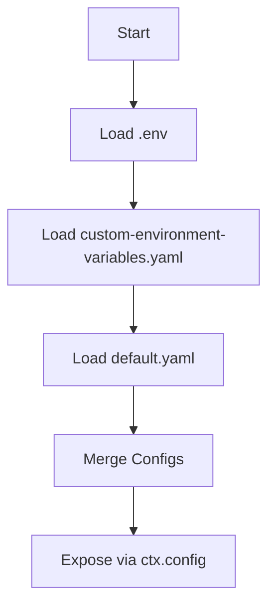

# Config

The configuration variables, along with their respective values, are specified within YAML files located in the `config/` directory. These variables are easily customizable to align with specific business use cases.

### Config structure

The default directory structure is outlined as follows

```
├── config
│   ├── custom-environment-variables.yaml
│   ├── default.yaml
├
├── .env
```

### File naming and Load order

The configuration files under `config/` directory can have specific naming conventions and load order. Please refer [File name and Load order](https://github.com/node-config/node-config/wiki/Configuration-Files#file-load-order) for more information.

## Environment variables

Environment variables in Godspeed are essential for securely managing configuration details like API keys, database URLs, and other sensitive information. Godspeed allows two primary ways to configure and access these variables.

### Configuration Setup for Environment Variables

Environment variables can be set up using:

1. **Define variables** in `config/custom-environment-variables.yaml`.
2. **Set values** in `.env` or use `export` in the terminal.
3. **Access variables** using `<% config.variable_path %>` in yaml and `ctx.config` in typeScript workflows.

### Step 1: Define Environment Variables in YAML Configuration

In the `config/custom-environment-variables.yaml` file, specify the environment variables you want to use across your project. This YAML file **maps environment variables** to meaningful keys, which you'll use in your code.

**Example `custom-environment-variables.yaml`:**

```yaml
my_datasource:
  base_url: MY_DATASOURCE_BASE_URL
  api_key: MY_DATASOURCE_API_KEY
  api_token: MY_DATASOURCE_API_TOKEN

kafka:
  brokers:
    __name: KAFKA_BROKERS
    __format: json
  client_id: KAFKA_CLIENT_ID

jwt:
  issuer: JWT_ISS
  audience: JWT_AUD
  secretOrKey: JWT_SECRET

prisma_secret: PRISMA_SECRET
```

### Step 2: Set Environment Variable Values

After defining environment variable keys in `custom-environment-variables.yaml`, you can provide actual values in two ways:

1. **Define in `.env` file**:

   - Open `.env` file and assign values to each variable specified in `custom-environment-variables.yaml`.

     **Example `.env` file:**

     ```plaintext
     MY_DATASOURCE_BASE_URL=https://httpbin.org/
     MY_DATASOURCE_API_KEY=your_api_key_here
     MY_DATASOURCE_API_TOKEN=your_api_token_here
     MY_ACCESS_TOKEN=yor_access_token

     KAFKA_BROKERS=["localhost:9092"]
     KAFKA_CLIENT_ID=my-kafka-client

     JWT_ISS=https://your-issuer.com
     JWT_AUD=https://your-audience.com
     JWT_SECRET=your_jwt_secret

     PRISMA_SECRET=your_prisma_secret
     ```

2. **Set values directly in the environment**:
   You can export these variables temporarily to environment by following the below syntax, based on the environment you are using:
   - **For shell/git bash**, use `export` command as:
     ```bash
     $ export MY_DATASOURCE_BASE_URL=https://httpbin.org
     $ export JWT_SECRET=mysecret
     $ export JWT_ISS= mycompany
     ```
   - **For windows powershell**
     ```
     $env:JWT_SECRET="mysecret"
     $env:JWT_ISS="mycompany"
     ```

:::info To reflect the updated values of the .env variables, you need to export them again after making changes. This ensures that the updated values are accessible and used in your application.
:::

### Step 3: Access Environment Variables in Your Project

Once environment variables are set up, they can be accessed in Godspeed Project as:

- **In Yaml Files**: Use the templating syntax `<% config.variable_path %>` to access the variable.

  **Example**:

  ```yaml
  datasource:
    base_url: <% config.my_datasource.base_url %>
  ```

- For cases where the variable needs to be embedded as part of a string, you can use JavaScript template string syntax within the Godspeed configuration, as shown below:

  ```yaml
  headers:
    Content-Type: application/json
    Authorization: <% `Bearer ${config.buildPiper.accessToken}` %> # to use Bearer + token
  ```

- **In TypeScript/JavaScript files**:
  Use `ctx.config` to access values within your TypeScript workflows.

  **Example TypeScript Workflow**:

  ```typescript
  import { GSContext, GSStatus } from "@godspeedsystems/core";

  export default async function myWorkflow(ctx: GSContext, args: any) {
    const apiKey = ctx.config.my_datasource.api_key;
    const apiUrl = ctx.config.my_datasource.base_url;

    if (!apiKey || !apiUrl) {
      throw new GSStatus(
        false,
        500,
        "Failed",
        "Missing configuration variables"
      );
    }

    // Use apiKey and apiUrl in your logic
    console.log("API Key:", apiKey);
    console.log("API URL:", apiUrl);

    return new GSStatus(true, 200, "OK", {
      message: "Environment variables accessed successfully",
    });
  }
  ```

  This setup provides a secure, centralized way to manage sensitive configuration data, making it easy to change values without modifying the source code.

## Static variables

The static variables as well as their values are defined in yaml files under `config/` directory. These variables can be replaced as per the business use cases. The default directory structure is given as below:

```
├── config
│   ├── default.yaml
```

:::note
Any configuration which includes secrets or passwords is recommended to be defined using environment variables only. Avoid using static variables for secrets and passwords.
:::

### default.yaml

This file contains some predefined variables. Below is a sample file which defines the static variables used in Godspeed.

```yaml
log:
  redact: # ['a.b.c', 'a.b.*', 'req.headers', 'mobileNumber'] #pino redact rules. Default null.
  level: debug #by default info
  sync: true #By default sync is false. For debugging, keep it true. For performance keep it false.
  timestamp: stdTimeFunctions.isoTime #Pino date formats
  bindings: # should pid and hostname be enabled in pino log bindings.
    pid: false
    hostname: true
defaults:
  lang: coffee #default language of inline scripting e.g. js/coffee
  on_error:
    continue: false # default behavior of on_error.continue property
server_url: https://api.example.com:8443/v1/api
httpbin: # sample api datasource url
  base_url: https://httpbin.org
```

Here, `defaults` key has the variables which are used by the framework for default values in workflow DSL.  
**1. lang** - By default, the framework sets it to `js`. Check [default language](../inline-scripting/overview.md/#default-language-at-global-level) for more information.  
**2. on_error.continue** - By default, the framework sets it to `false`.

## Actionable Config Examples

### Accessing Config in YAML

```yaml
datasource:
  base_url: <% config.my_datasource.base_url %>
```

### Accessing Config in TypeScript

```typescript
import { GSContext } from "@godspeedsystems/core";
export default function (ctx: GSContext) {
  const apiKey = ctx.config.my_datasource.api_key;
  // Use apiKey in logic
}
```

### Using Environment Variables in .env

```env
MY_API_KEY=your_api_key_here
```

## Troubleshooting & FAQ

- **Q: Config value not found?**
  - Check YAML key path and .env variable spelling
- **Q: Env variable not loaded?**
  - Ensure it is defined in `custom-environment-variables.yaml` and present in `.env`
- **Q: Static config not applied?**
  - Validate YAML structure and file load order

## LLM Guidance & Prompt Templates

- **Prompt:** "Show a YAML example for accessing an API key from config."
- **Prompt:** "Write a TypeScript function that reads a database URL from config."
- **Prompt:** "Generate a .env and custom-environment-variables.yaml for a new datasource."

## Best Practices & Anti-Patterns

**Best Practices:**

- Use environment variables for all secrets/keys
- Keep config modular and organized by feature
- Document all config keys and usage
- Use static config only for non-sensitive values

**Anti-Patterns:**

- Hardcoding secrets in static config
- Duplicating config keys
- Skipping documentation for config
- Ignoring file load order

## Cross-links

- [Datasources](../datasources/overview.md)
- [API & Event](../API%20&%20Event.md)
- [Workflows](../workflows/overview.md)
- [Plugins](../plugins/sample-configs.md)

## Config Loading Flow Diagram



## Glossary

- **Config:** Centralized project settings
- **.env:** File for environment variables
- **custom-environment-variables.yaml:** Maps env vars to config keys
- **Static Config:** Hardcoded YAML values
- **Dynamic Config:** Values loaded at runtime
