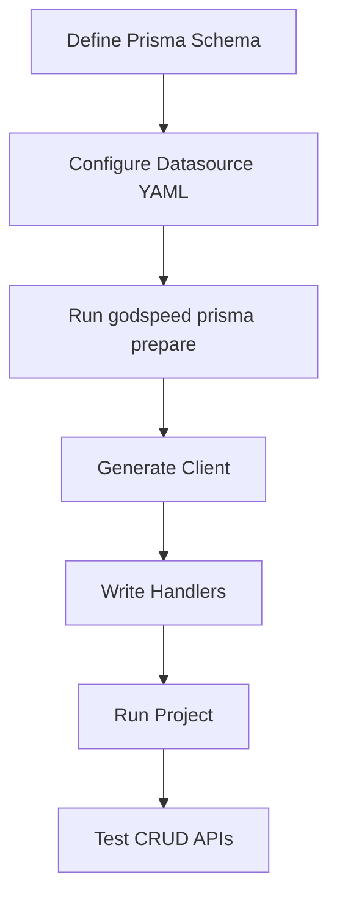

# Database Support Overview

The framework takes the approach of schema driven development. It supports multiple kinds of SQL and NoSQL databases. The developer only needs to specify or generate the schema for a database, with authorization policies. The CRUD events and workflows are automatically generated from the schema itself.

The framework provides functionality to access almost all popular databases through Prisma-as-datastore plugin [Plugin Repository](https://github.com/godspeedsystems/gs-plugins/tree/main/plugins/prisma-as-datastore) which is a powerful tool for efficient and secure database interactions in web applications.

### List of currently supported Databases

**1. [PostgreSQL](PostgreSQL)**: Prisma has strong support for PostgreSQL, one of the most popular open-source relational database systems.

**2. [MySQL](MySQL)**: Prisma can be used with MySQL, another widely used open-source relational database management system.

**3. [SQLite](https://www.prisma.io/docs/orm/overview/databases/sqlite)**: SQLite is a serverless, self-contained, and zero-configuration database engine, and Prisma supports it as well.

**4. [SQL Server](SQLServer)**: Prisma offers support for Microsoft SQL Server, a popular commercial relational database management system.

**5. [MongoDB (Experimental)](MongoDB)**: Prisma also has experimental support for MongoDB, a NoSQL database, although this support may not be as mature as for relational databases.

**6. [CockroachDB](CockroachDB)**: A distributed, resilient SQL database for large-scale, cloud-native applications.

**7. [MariaDB](MariaDB)**: An open-source, high-performance relational database system and MySQL-compatible alternative.

**8. [PlanetScale](PlanetScale)**: PlanetScale is a database-as-a-service platform designed for distributed SQL databases. It provides a managed, scalable, and highly available database solution for modern, cloud-native applications.

## How it works

You can integrate any of the above databases into your project by following a few simple steps:

**Step 1: Install the Prisma-as-datastore-plugin**, See [How to install](../datasources/datasource-plugins/Prisma%20Datasource.md#how-to-add-plugin)

**Step 2: Set your Database_Connection_URL**
To connect with the database, give your db_connection_url in .env file. You can check the format and example of Connection_url for all the supported databases in the [next section](MySQL#connection-url)

**Step 3: Schema specification**
The framework extends Prisma specification to define the schema for any database. You can create your prisma schema in the src/datasources folder as a file `{database_name}`.prisma.

**Check [Sample Prisma Schema](../datasources/datasource-plugins/Prisma%20Datasource.md#sample-prisma-schema)**

**Step 4: Prisma Database and Models Setup**
The framework has inbuilt feature of setting up database automatically whenever a new schema `{database_name}`.prisma file is created in the src/datasources folder. Just type this command in CLI

```
 'godspeed prisma prepare'
```

### Generate CRUD API

Now you can generate CRUD API using following command

```
 'godspeed gen crud api'
```

#### To see advanced functionalities related to databases, please visit these sections

#### [Database Encryption](../datasources/datasource-plugins/Prisma%20Datasource.md#database-encryption)

<!-- #### [Database Authorization](../datasources/datasource-plugins/Prisma%20Datasource.md#database-authorization) -->

## Reference links

**-** [Plugin Repository](https://github.com/godspeedsystems/gs-plugins/tree/main/plugins/prisma-as-datastore)

## Actionable Database Integration Examples

### Prisma Datasource (YAML)

```yaml
type: prisma
provider: postgresql
url: <% config.db.url %>
```

### Sample Prisma Model

```prisma
model User {
  id    Int    @id @default(autoincrement())
  name  String
  email String @unique
}
```

### TypeScript: Querying the Database

```typescript
import { GSContext, GSStatus } from "@godspeedsystems/core";
export default async function (ctx: GSContext) {
  const user = await ctx.datasources.prisma.client.user.findUnique({
    where: { id: 1 },
  });
  return new GSStatus(true, 200, "User fetched", user);
}
```

## Troubleshooting & FAQ

- **Q: Database connection error?**
  - Check `.env` for correct URL and credentials
  - Ensure DB is running and accessible
- **Q: Prisma client not generated?**
  - Run `godspeed prisma prepare` after schema changes
- **Q: CRUD API not working?**
  - Confirm event YAML and handler are correct

## LLM Guidance & Prompt Templates

- **Prompt:** "Show a YAML example for a PostgreSQL datasource using Prisma."
- **Prompt:** "Write a TypeScript handler to fetch a user from the database."
- **Prompt:** "Generate a troubleshooting checklist for database integration."

## Best Practices & Anti-Patterns

**Best Practices:**

- Use environment variables for all DB credentials
- Keep Prisma schema and event YAML in sync
- Validate all input/output schemas
- Regularly update and test DB migrations

**Anti-Patterns:**

- Hardcoding DB credentials in YAML or code
- Skipping schema validation
- Ignoring Prisma warnings/errors
- Not testing DB connection after changes

## Cross-links

- [Datasources](../datasources/overview.md)
- [API & Event](../API%20&%20Event.md)
- [Workflows](../workflows/overview.md)
- [CLI](../CLI.md)

## Database Integration Flow Diagram



## Glossary

- **Prisma:** ORM for database access
- **Datasource:** DB connection config
- **Model:** Table/entity definition in Prisma
- **Migration:** DB schema update
- **CRUD:** Create, Read, Update, Delete operations
