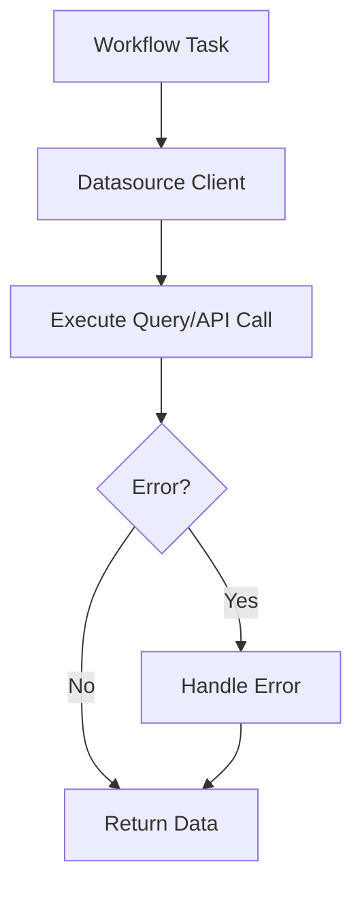

# Data Sources

## Overview

Data sources play a central role in the Godspeed Framework, serving as the origins or locations from which data can be collected and stored. This documentation provides an overview of data sources within the framework, their usage, and how to invoke them from within workflow tasks.

In the Godspeed Framework, data sources are fundamental components that enable users to access and manipulate data from various origins. Examples of data sources include databases,message bus, cache, file systems, and third-party APIs.

Data sources can be seamlessly integrated into your workflow tasks using a standardized syntax. The key element for invoking data sources is the fn attribute, which is namespaced under datasource. Here's an example of how data sources are used within a workflow task:

### Demonstration

<div style={{ position: 'relative', paddingBottom: '56.25%', height: 0, overflow: 'hidden' }}>
<iframe style={{ position: 'absolute', top: 0, left: 0, width: '100%', height: '100%' }} src="https://www.youtube.com/embed/NsH9hLCL92Y" frameborder="0" allowfullscreen></iframe>
</div>

## Datasource Types

Datasources can be divided into two types, "Datastore as datasource" and "API as a datasource"


Example 1: Datastore as Datasource [prisma-as-datastore](/docs/microservices-framework/datasources/list-of-plugins#1-prisma-as-datasource)

<!-- ```yaml
id: workflow_1
description: This workflow will fetch the user with userId from the mongo database
tasks:
  - id: task_1
    fn: datasource.mongo.User.findOne
    args:
      where:
        userId: <% inputs.params.userId %>
``` -->

```ts
import { GSContext, GSStatus } from "@godspeedsystems/core";

module.exports = async (ctx: GSContext) => {
  const {
    inputs: {
      data: { params },
    },
    logger,
    datasources,
  } = ctx;

  const response = await datasources.mongo.client.Post.findUnique({
    where: { id: params.id },
  });
  return new GSStatus(true, 200, "Post fetched", response);
};
```

In this example:

`datasources.mongo.client.Post.findUnique` is the datasource function, which can be described as below:

- `datasources`: fixed namespace for all data sources for typescript functions
- `mongo`: name of datasource (name of prisma schema in case of prisma datasource), you can use any database provider, checkout [supported databases list](/docs/getting-started/advance-guide#prisma-supports-wide-range-of-databases)
- `Post`: entity name
- `findUnique`: method to be invoked in entity name

the workflow is consuming the datasource `mongo` and finding one document from Post entity.

:::tip **Godspeed has "Prisma as datastore plugin", which provides a uniform access to all databases**
:::

To enable this seamless interaction with datasources, the Godspeed Framework allows you to configure data sources within your project. For instance, the example mentions the use of the "prisma-as-datastore" plugin to define the "mongo" data source. This configuration step ensures that the framework can establish connections and communicate effectively with the specified data source.

In the above example there is a `mongo` datasource defined in the project, you are free to name your datasource as you like. A default config of your datasource is present in `src/datasources` folder.

Example 2: API Datasource [axios-as-datasource](/docs/microservices-framework/datasources/list-of-plugins#2-axios-as-datasource)

<!-- ```yaml
id: post_api_send_anthing
tasks:
  - id: send_anything
    # Fetching loan offers from rule engine for the given bank and pan card
    fn: datasource.api_datasource.post./anything
    args:
      data:
        message: <%inputs.body.message%>
``` -->

```ts
import {
  GSContext,
  GSDataSource,
  logger,
  PlainObject,
} from "@godspeedsystems/core";

export default async function (ctx: GSContext) {
  const res = await ctx.datasources.api.execute(ctx, {
    meta: {
      method: "get",
      url: "/anything",
    },
  });
  return res;
}
```

In the above example:

- `datasources`: fixed namespace for all data sources
- `api`: name of data source,
- `get`: API method
- `./anything`: API endpoint

## Actionable Datasource Examples

### MongoDB Datasource (YAML)

```yaml
type: prisma
provider: mongodb
url: <% config.mongo.url %>
```

### API Datasource (YAML)

```yaml
type: axios
base_url: https://api.example.com
headers:
  Authorization: <% config.api.token %>
```

### Using Datasource in Workflow (YAML)

```yaml
tasks:
  - id: fetch_user
    fn: datasource.mongo.User.findOne
    args:
      where:
        userId: <% inputs.params.userId %>
```

### Using Datasource in TypeScript

```typescript
import { GSContext, GSStatus } from "@godspeedsystems/core";
export default async function (ctx: GSContext) {
  const user = await ctx.datasources.mongo.client.User.findUnique({
    where: { id: ctx.inputs.data.params.id },
  });
  return new GSStatus(true, 200, "User fetched", user);
}
```

## Troubleshooting & FAQ

- **Q: Datasource not connecting?**
  - Check your config and `.env` for correct credentials/URLs
- **Q: API call fails?**
  - Inspect headers, base_url, and network connectivity
- **Q: DB query returns empty?**
  - Validate query structure and input parameters
- **Q: Plugin not found?**
  - Ensure the plugin is installed and configured in `src/datasources/`

## LLM Guidance & Prompt Templates

- **Prompt:** "Generate a Godspeed datasource YAML for a Redis cache."
- **Prompt:** "Write a workflow that fetches data from an API datasource."
- **Prompt:** "Show a TypeScript example for querying a PostgreSQL datasource."

## Best Practices & Anti-Patterns

**Best Practices:**

- Use environment variables for all secrets/URLs
- Keep datasource configs modular and reusable
- Validate all input/output schemas
- Use retry logic for API datasources
- Regularly update plugins for security

**Anti-Patterns:**

- Hardcoding credentials in YAML
- Duplicating datasource configs
- Skipping error handling for API/DB calls
- Ignoring plugin updates

## Cross-links

- [Workflows](../workflows/overview.md)
- [API & Event](../API%20&%20Event.md)
- [Plugins](../plugins/sample-configs.md)
- [Config](../config-and-mappings/config.md)

## Datasource Invocation Flow Diagram



## Glossary

- **Datasource:** External system (DB, API, cache, etc.)
- **Plugin:** Extension for new datasource types
- **Prisma:** ORM for DB access
- **Axios:** HTTP client for API datasources
- **Retry:** Logic for handling transient errors
- **Config:** Centralized configuration for datasources
