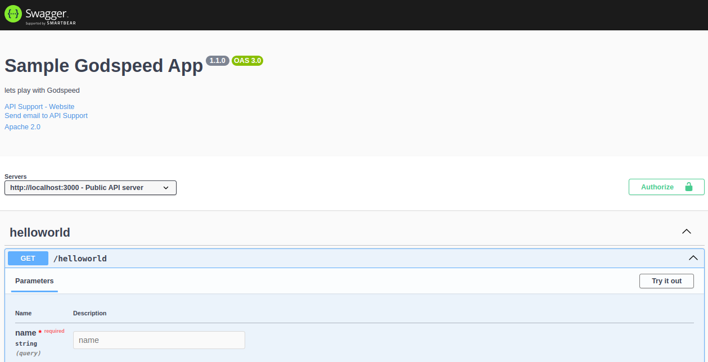
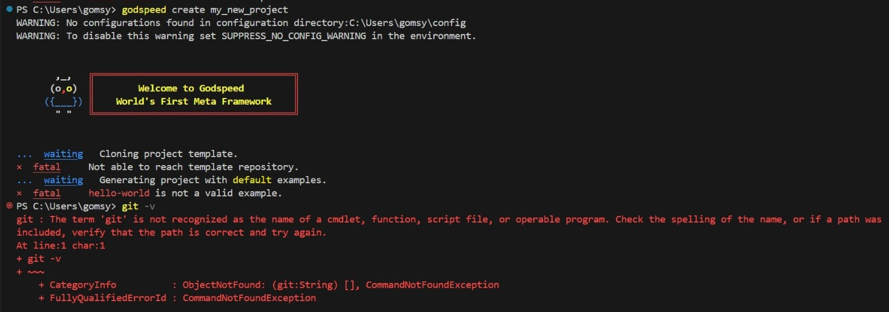
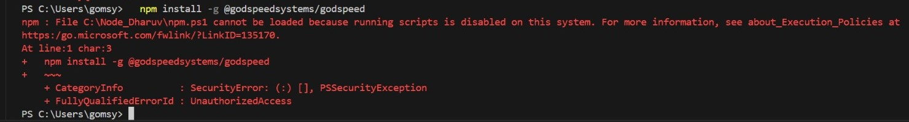
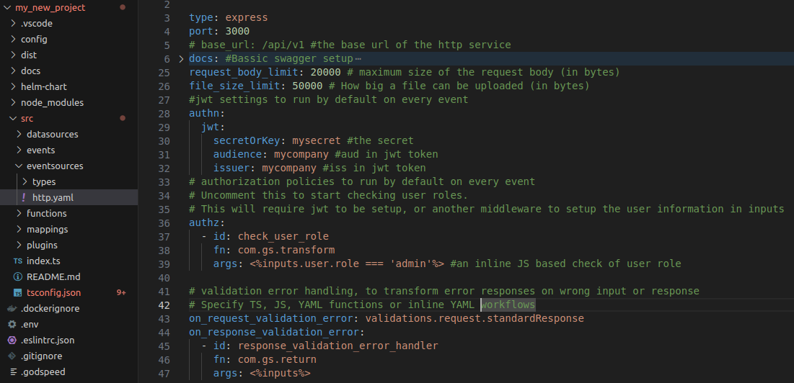

# Getting Starting with Godspeed
**This guide will walk you through:**
- Installing the Godspeed Meta-Framework on your system.
- Creating your first project and running it locally.

:::tip Need Help?
**Ask Godspeed GPT First!**

Whether you're having trouble with setup, configurations or understanding the framework, try asking [Godspeed GPT](https://chatgpt.com/g/g-Zsh9qhlGw-vishwakarma)
:::

### Pre-requisites:
1. Nodejs v18 (or higher) or Bunjs 
2. Npm
3. Git
4. VS Code or any code editor

:::tip
To install prerequisites and Godspeed through our Easy Installation Script, Download this script file [setup.bat](../../../static/script/setup.bat)
- It simplifies the installation process by checking all required tools in one go.
:::
<details>
<summary> See How to execute this script in Windows: </summary>

1. Run Command Prompt as Administrator.

2. Use cd command to change the directory to where you downloaded the setup.bat file.

3. Execute the script by writing its name.
```
  C:\Users\HP\Downloads> setup.bat
```
</details>

Once the script finishes, you are ready to **[Create Your First Project](/docs/microservices-framework/guide/get-started#step-2-create-your-first-project)**

### **Step 1: Install Godspeed manually**  
1. **Ensure Node.js, Npm and Git is installed**:
   - Verify versions by running the following commands from terminal:
     ```bash
     node -v
     npm -v
     git -v
     ```
   - You should see something like `v18.x.x` for Node.js and `8.x.x` or higher for npm if installed.
   - It will show error in case any of above pre-reqisites is not installed, so download and install it first.
2. **Install Godspeed globally**:
   - Run this command to install the Godspeed meta-framework:
     ```bash
     npm install -g @godspeedsystems/godspeed
     ```
3. **Verify installation**:
   - Run the following command to ensure Godspeed is installed:
     ```bash
     godspeed --version
     ```
---     
### **Step 2: Create Your First Project**

1. **Create a new Godspeed project**:
   - Use the `create` command to set up a new project:
     ```bash
     godspeed create my_new_project
     ```
   - Replace `my_new_project` with the name of your project.
   - This step may take some time as it installs required npm plugins and creates the project structure. Be patient!

2. **Navigate to your project folder**:
   ```bash
   cd my_new_project
   ```
3. **Start the server**:
  ```
     godspeed serve
  ```
Check the logs. They should indicate that the **Express server** is running on **port 3000**.
  Example log:
  ```bash
  INFO:[Production Server Running]('express:' eventsource, '3000' port) Try it out at: http://localhost:3000/api-docs
  ```
---

### **Step 3: Test the Helloworld API**

1. **Open Swagger UI**:
   - Open your browser and navigate to `http://localhost:3000/api-docs`. This will display the **Swagger UI**.
    

2. **Try It Out**:
- In the Swagger UI, locate the `/helloworld` endpoint.

  Click the **`Try it out`** button and send a request to test the API, It will ask you to fill the name. Once you fill and submit the name parameter,(e.g. John) then following response will be returned from the server.
  ```
    Hello `John`      
  ```
Default port of your service is `3000` and Swagger endpoint is `/api-docs`. If you want to customise default settings, you can modify the `./src/eventsources/http.yaml`

To understand working of this API [Lets Walkthrough your first Godspeed Project](https://godspeed.systems/docs/microservices-framework/guide/get-started#walking-through-your-first-godspeed-project)

### Troubleshooting Common Errors

**Error: Not Able to reach Template repository or hello-world is not a valid example**



While creating a new godspeed project, if you face above error, it means **Git is not installed** on your system. 
The framework needs Git to clone the template for your new project.

**Solution**:
1. **Install Git**:
   - After installation, verify by running:
       ```bash
       git --version
       ```
2. **Re-run the Godspeed create command**:
   - Once Git is installed, rerun the command:
     ```bash
     godspeed create my_new_project
     ```
---
**Error: Running scripts is disabled on this system (Windows)**

This error occurs because of Windows PowerShell's execution policy, which restricts running scripts by default.

**Solution:**
1. Open PowerShell **as Administrator**.
2. Run the following command to allow script execution:
   ```bash
   Set-ExecutionPolicy RemoteSigned
   ```
3. Press **Y** to confirm.
4. Close PowerShell and rerun your `godspeed serve` command.

**Note**: This change allows local scripts to run, but blocks downloaded scripts unless they're signed by a trusted publisher.


## Walking through your first Godspeed project

- **Scaffolding of a meta-framework project**



- The framework generates different folders like [config](/docs/microservices-framework/config-and-mappings/config.md), [datasources](/docs/microservices-framework/datasources/overview.md), [events](/docs/microservices-framework/event-sources/event-schema.md), [eventsources](/docs/microservices-framework/event-sources/overview.md), [functions](/docs/microservices-framework/workflows/overview.md), [mappings](/docs/microservices-framework/config-and-mappings/mappings.md), [plugins](/docs/microservices-framework/inline-scripting/script-plugins.md),etc
- The `eslintrc.json` file includes a curated list of recommended plugins that can be incorporated into the project.
- We configure [swagger specs](/docs/microservices-framework/event-sources/event-types/http-events.md#swagger-specs) in src/eventsources/http.yaml

:::tip
To understand more about the scaffolding structure of the project , Check [here](/docs/microservices-framework/guide/walkthrough#moving-forward)
::: 

- **Why is Swagger asking you to fill the name?**

  /helloworld API endpoint asks you to fill in the name parameter because the API has been configured to require this parameter as part of the query string.
  Go to `src/events/helloworld.yaml` file, which is the event schema of this API in YAML format.
  ```
    http.get./helloworld: # `http` server listening via `get` method on `/helloworld` endpoint
    fn: helloworld # the function handler to be called for this endpoint, available in `src/functions`
    params: # JSON-Schema of API parameters like query, headers, path params. Note: This is set as per Swagger standard's `parameters` syntax
      - name: name   # This is our name query param
        in: query    # Notice the in: query, it can be `path` or `headers` as well
        required: true # true means `name` parameter is required
        schema:
          type: string
    responses: # JSON-Schema of API responses for different status codes. Note: This is set as per Swagger standard's `responses` syntax
      200:
        content:
          application/json:
            schema:
              type: string
  ```
  In this helloworld.yaml file, the params section defines that the API requires a name parameter to be passed in the query string. Let’s break it down:
- **params:** This section describes the input the API expects. In this case, the API expects a name parameter, which  must be provided by the user when they call the /helloworld endpoint.
- **name: name:** This line specifies that the query parameter is called name.
- **in: query:** This tells Swagger and the Godspeed server that the name parameter should be included in the query string of the URL (e.g., /helloworld?name=John).
- **required: true:** The name parameter is mandatory. This means the API will not work unless this parameter is provided by the user.
- **schema: { type: string }:** The name parameter must be a string, which further validates that the input should be text.

:::tip
In the Godspeed meta-framework each API whether REST or Graphql API is called an `event`. All events, whether API calls or websocket messages, trigger workflows/functions which can be thought of as event handlers (see `fn:` instruction in the yaml above). 
The sync events return a response while async events dont have a concept of response.
:::

This naming approach may be new for you. The general norm across the larger developer community is to call only `async events` as `events` - for ex. Kafka or web socket message. But in Godspeed world we consider both sync APIs (REST, Graphql) and async events (Message bus, web socket, cron) - as events. 

### Testing the validation of API inputs and outputs

Almost every application needs validation of data sent in request to the API and response sent back by the service, to make sure that wrong data could not enter your service nor should it return wrong response for an API call. Let's try this feature in the framework.

1. Open your browser and hit the `/helloworld` endpoint via `localhost:3000/helloworld`. Or, run `curl -i localhost:3000/helloworld` from your terminal.
2. This should return an error with code `400` because you have not passed `name` in query - as expected by the schema of `helloworld` API. 

```
{
  "validation_error": {
    "success": false,
    "code": 400,
    "message": "request validation failed.",
    "error": "must have required property 'name' in query",
    "data": {
      "message": "The API cannot be executed due to a failure in request params schema validation.",
      "error": {
        "instancePath": "",
        "schemaPath": "#/required",
        "keyword": "required",
        "params": {
          "missingProperty": "name"
        },
        "message": "must have required property 'name' in query"
      }
    }
  }
}

```
3. If you hit `localhost:3000/helloworld?name=mastersilv3r`, it should work.
```
Hello mastersilv3r
```

#### Swagger Collection

 If you need access to the Swagger collection of godspeed project, open it from `/docs` folder in your project. This is automatically generated from your API schema which we saw above. 

#### Postman Collection

 If you need the Postman Collection, import the Swagger file from `src/docs` in Postman.

### For any help
Try the below command line which will show you the commands that can be used in the godspeed framework. Refer [the full CLI spec](/docs/microservices-framework/CLI.md) for more information, including [how to add plugins for eventsources and datasources](../CLI#using-plugins)  

```bash
   godspeed --help
```

### Video Tutorial - Short
There is a longer and detailed introduction video as well, below on this page.

<div style={{ position: 'relative', paddingBottom: '56.25%', height: 0, overflow: 'hidden' }}>
    <iframe style={{ position: 'absolute', top: 10, left: 10, width: '100%', height: '80%' }} src="https://www.youtube.com/embed/vudhjYjGeLQ?si=R4kTbH14-sAbKFBA" frameborder="0" allow="fullscreen;" allowfullscreen ></iframe>
</div>


> If you want some pre-made examples please check the [examples repository](https://github.com/godspeedsystems/gs-node-templates)

### Video Tutorial - Longer and in depth

**Walkthrough the Loan Origination System project made using our meta framework**

<div style={{ position: 'relative', paddingBottom: '56.25%', height: 0, overflow: 'hidden' }}>
<iframe style={{ position: 'absolute', top: 0, left: 0, width: '100%', height: '100%' }} src="https://www.youtube.com/embed/BTPHPoI3dh0" frameborder="0" allowfullscreen></iframe>
</div>


