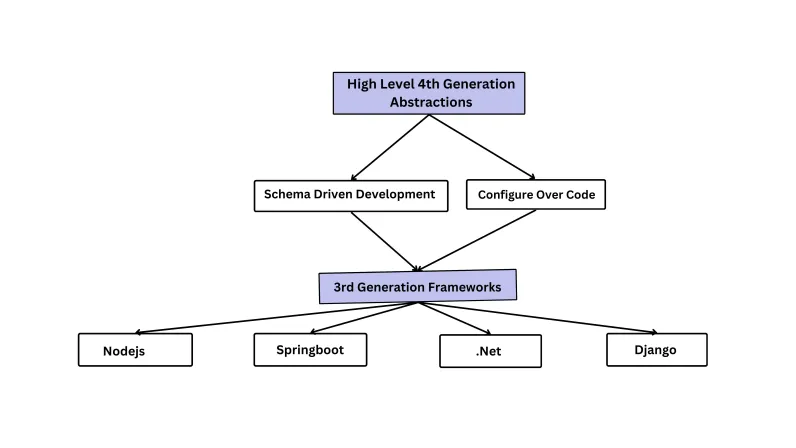

# Diving Deeper

In the previous section we got an understanding on how to setup a meta-framework based project for your local development and create a new project via cli commands. This section is dedicated to providing hands-on practice in constructing comprehensive backend services utilizing the meta framework and its associated plugins. Additionally, it aims to facilitate a thorough understanding of all the fundamental concepts underpinning the Godspeed framework.

### Video Playlist for Detailed Walkthrough

> Don't miss! Video Playlist of detailed guide to eventsources, events, functions and datasources: [Watch here](https://www.youtube.com/watch?v=GdJ0ghpQ7oA&list=PLRuRJ3PaaJ7ti9bfStNTXqsxxW9wvwA_H)

### As we move forward

Do ckeck the [tenets](../introduction/tenets.md), [design principles](../introduction/design-principles.md) and [guardrails](../introduction/guard-rails.md) baked into the meta-framework as part of its design - helping teams develop microservices based applications with best practices. 

#### The three pillars
Have you seen the [three pillars of abstraction](../introduction/design-principles.md#three-fundamental-abstractions) in the Meta-Framework?

- [Eventsources and event schemas](../event-sources/overview.md)
- [Event handler functions (Pure functions)](../workflows/overview.md) 
- [Datasources](../datasources/overview.md)

You may want to check why you should use the [4th generation](https://godspeed.systems/blog/godspeed-fourth-generation-programming-framework) Meta-Framework versus creating apps using pure 3rd generation frameworks like Nodejs or Django stack from scratch.



> Note: The Meta-Framework currently supports Nodejs based ecosystem

### Moving forward
:::tip
As mentioned in the [getting started](./get-started.md) section all APIs and async events are together referred to as `events`. And hence any source like Express, Fastify, Kafka, Apollo Graphql are called [EventSources](../event-sources/overview.md).
:::
In [getting started](./get-started.md) section we created a project that includes a simple 'hello world' example which uses an http Express [eventsource](../event-sources/overview.md), [events](/docs/microservices-framework/event-sources/event-schema.md) and [event handler functions](/docs/microservices-framework/workflows/overview.md). 


Now we can move into further details.

:::tip
In order to see detailed examples and documentation of eventsources, events and event handlers please visit [Express HTTP Eventsource Plugin documentation](../event-sources/event-source-plugins/Express%20Http%20Eventsource.md).  
:::

### Event Configuration

> All event definitions are stored in `src/events` folders in YAML files. Each YAML file can have multiple events or a single event defined. The folder structure within `src/events` determines the categories (grouping of your API) that you will see in the generated Swagger and Postman collection. You can group events in any files and nested folders as per your need.

Now lets understand how our `helloworld` api endpoint is working behind the scene

**Open `./src/events/helloworld.yaml`**

```yaml
"http.get./helloworld":
  fn: helloworld # event handler function - the logic resides here
  authn: false
  params: #same as Swagger params.
    - name: name
      in: query
      schema:
        type: string
```

Lets understand the first line from the above snippet `http.get./helloworld`. 

#### `http`: Protocol http eventsource

#### `get` : method

#### `/helloworld`: endpoint

We are exposing an endpoint with a `get` method on `http` protocol. This endpoint is calling a function `fn`: `helloworld` in the second line of the above code snippet.

> For the sake of brevity, in the above example we have omitted further details of event configuration like the JSON schema of `body, query, headers, responses` and as well `authn, authz` settings among more. 

:::tip
You can find in-depth introduction to event schema [here](/docs/microservices-framework/event-sources/event-schema).
:::

The meta-framework follows Schema Driven Development and Single Source of Truth as its first guardrail. [Check the blog here](https://godspeed.systems/blog/schema-driven-development-and-single-source-of-truth) on reasons why this is an essential practice for any 10x engineering team. It allows you to use the Swagger (aka OAS3) spec which includes JSON schema spec, to define your event schemas as single source of truth. The schema format remains same independently of the eventsource which listens on an event. 

From your event schemas the meta-framework generates the Swagger specs, Graphql schema (if applicable) and also enable input validation, output validation, authentication, authorization without explicitly writing boilerplate code.

The [event configuration](/docs/microservices-framework/event-sources/event-schema) uses Swagger and JSON Schema for defining shape of `requestBody, params, query, headers & responses`. The overall event schema has more configurations as well, like `authn, authz`. Further the event schemas in the meta-framework are universally same across all event sources *with only two variations per eventsource* which are
- First line of the event URI may change based on the type of eventsource. 
  ```yaml
    http.{method}.{url}: # http event URI - same for Express, Fastify and Graphql plugins
    kafka.{topic}.{group_id}: # kafka event URI
    cron.* * * * *.Asia/Kolkata: # cron event
  ```
- Async events don't return response and hence don't need `responses` in the shema. But REST and Graphql events should have a `responses` section, defined in Swagger format. 

For http service like Express, Fastify and Graphql, all events are defined in the same format. This way you learn once and reuse everywhere, independent of the event source which is capturing the event. This is the fourth guardrail of the Meta Framework - Decoupled or Modular Architecture.


### Event Handler Functions

[Event handlers](../workflows/overview.md) are **pure functions** which take input as JSON and return output as JSON, independent of the eventsource from which the event originated. This is again another adoption of decoupled architecture approach in the meta framework.

**Sample typescript event handler function**
Here is how a function handler looks like.

```typescript
import { GSContext, PlainObject } from "@godspeedsystems/core";

export default function (ctx: GSContext) {
    const {body, headers, params, query, user} = ctx.inputs.data;
    const name: string = query.name; //name expected in request query
    return {
        data: 'Its working! ' + name, //the data key gets set as the body in API response
        code: 200, //Response status code
        success: true, //success can be true or false
        headers: { //custom headers to be attached from this function call
            custom_response_header: 'something'
        }
    }
    //Note: if you wish to use static typing in returning the response instead of using JSON, you can return GSStatus. More on that below.
}
```

We are importing [GSContext](/docs/microservices-framework/workflows/native-language-functions#gscontext) & [GSStatus](/docs/microservices-framework/workflows/native-language-functions#gsstatus) from core package of meta-framework. Go to their respective section to more about them.

<!-- 
**Sample YAML function**
This DSL helps you reduce your lines of code and avoid boilerplate and is an alternative to writing logic in Typescript or Javascript functions. Its downside is that YAML does not have type checking and currently Godspeed does not support autocompletion of YAML workflows like you can have in Typescript within VSCode or another IDE.

```yaml
id: helloworld
tasks:
  - id: first_task
    fn: com.gs.return
    args:
      data: <%'Its working! ' + inputs.body.name%>
      code: 200
      success: true #by default success is assumed to be true
      headers: 
        custom_response_header: 'something'
```

The helloworld event is calling the above function written in YAML, which is executing a task with id `first_task`. This task is calling `fn: com.gs.return` function that takes argument name in an [inline script](/docs/microservices-framework/inline-scripting/overview). -->


So far we have seen how can we use Express plugin and also we created an endpoint which returns a response with some code and headers. 

### Swagger generation

The meta-framework gives you an autogenerated Swagger collection and UI to test your API endpoints.

If you are new to Swagger or in other words Open API Spec 3, along with JSON Schema standard, then we strongly suggest to study that. These are standards for defining schema of HTTP APIs. A Swagger schema can also be imported in a Postman collection, or generated from Postman. 

Your Swagger docs are automatically generated and stored in `/docs` folder when the project starts or you make a change to your eventsource or event schemas. The documentation is generated from a combination of settings at Eventsource and events levels.

- **Eventsource level** (refer the `docs` section in http.yaml). This is applicable for Express and Fastify eventsources.
- **Event level**
  - When you enable authentication on an event, its security scheme is set accordingly in generated swagger. By default authentication is enabled on all events when enabled on eventsource instance level itself.
  - `requestBody`, `params`, `responses` ,`operationId`, `id`, `summary`, `description`, `tags` are also picked up or auto-calculated from event spec.

> See more details on Swagger related configurations in http eventsource and event level both, in [Express Plugin documentation](../event-sources/event-source-plugins/Express%20Http%20Eventsource.md)

### CRUD API generation
Checkout how to generate CRUD APIs in a [step by step guide](../CRUD_API.md).

### Graphql setup with schema generation
Check out the [Apollo Graphql plugin documentation](../event-sources/event-source-plugins/Apollo%20GraphQl%20Eventsource.md) for more details.

### Datasources
[Datasources](../datasources/overview.md) are any locations which allow to send or retrieve data. These could be another API service, message bus, file system, database, text search engine etc. 

### Using Datasource and Eventsource Plugins
You can import any datasource or eventsource in your project without writing code, with the available plugins for [eventsources](../event-sources/event-source-plugins/Overview.md) and [datasources](../datasources/list-of-plugins.md). 

#### **Eventsource Plugins**

Currently officially supported eventsources plugins are [Express Server](../event-sources/event-source-plugins/Express%20Http%20Eventsource.md), [Fastify Server](../event-sources/event-source-plugins/Fastify%20Eventsource.md), [cron](../event-sources/event-source-plugins/Cron%20Eventsource.md), [Kafka](../event-sources/event-source-plugins/Kafka%20Eventsource.md) & [Apollo Graphql Server](../event-sources/event-source-plugins/Apollo%20GraphQl%20Eventsource.md)

#### Datasource Plugins
Currently officially supported datasource plugins are [Prisma](../datasources/datasource-plugins/Prisma%20Datasource.md), [Mongoose](../datasources/datasource-plugins/Mongoose%20Datasource.md), [Axios](../datasources/datasource-plugins/Axios%20Datasource.md), [Memcached](../datasources/datasource-plugins/Memcached%20Datasource.md), [Kafka](../datasources/datasource-plugins/Kafka%20Datasource.md), [Redis](../datasources/datasource-plugins/Redis%20Datasource.md), [AWS](../datasources/datasource-plugins/AWS%20Datasource.md)

#### Creating Own Plugins

You can modify our existing plugins or create new plugins from scratch and reuse across your projects. A detailed overview of how to [create eventsource plugins](../event-sources/create-eventsource-plugin.md) and [datasource plugins](../datasources/create-datasource-plugin.md) exists.

### JWT authentication

> The Meta Framework currently supports standardised JWT authentication implementation across [Express](../event-sources/event-source-plugins/Express%20Http%20Eventsource.md), [Fastify](../event-sources/event-source-plugins/Fastify%20Eventsource.md) and [Apollo Graphql plugins](../event-sources/event-source-plugins/Apollo%20GraphQl%20Eventsource.md).

Configure the eventsource to enable jwt authentication. More detailed information about authentication available [here](../authentication/overview.md)

**Configuring JWT in Express "./src/eventsources/http.yaml"**
> Express, Fastify and Graphql plugins support standard way of handling JWT based authenticatin.
```
type: express
jwt:
  issuer: <%config.issuer%> 
  audience: <%config.audience%> 
  secretOrKey: <%config.secret%>
```
*This enables JWT authentication on all your endpoints for the given eventsource. *

**Disabling authentication on a given endpoint**
You can disable authn on any endpoint by setting `authn: false`
```yaml
"http.get./helloworld":
  fn: helloworld
  authn: false
```

### Authorization (RBAC, ABAC, PBAC)
The meta-framework gives you full freedom to handle authorization [(more details here)](../authorization/overview.md) based on RBAC, ABAC or PBAC, in a generic way, independent of the event source. You can integrate any IAM or policy engine to use with the meta-framework. 

**Authorization at eventsource level**
Authorization can be a list of YAML instructions or just one function which could be in turn TS, JS or YAML function in Godspeed's DSL.

```yaml
authz: 
  - fn: com.gs.is_allowed

# OR
authz: com.gs.is_allowed
```

**Disabling authorization at event level**
If authorization is enabled at eventsource level for all its events, but you wish to disable authorization for any particular events, you can disable authorization at an event level by saying `authz: false`.

```yaml
"http.get./helloworld":
  fn: helloworld
  authz: false
```

**Customizing authorization at event level**
If authorization is enabled at eventsource level for all its events, but you wish to customise authorization for any particular events, you can disable authorization at the event level, by setting an authorization function there itself.
```yaml
"http.get./helloworld":
  fn: helloworld
  authz: com.biz.user_is_allowed_for_this_event 
```

### Referencing pre-made project templates
Pre-made projects are a great place to start learning about the meta-framework. You can refer these pre-made examples to learn about different features of meta-framework, and reuse the code from there. Feel free to clone, refer and re-use the repos given below.

#### Basic Project

Repository - [Hello World](https://github.com/godspeedsystems/gs-node-templates/tree/master/hello_world)

#### Full Stack App
A full stack app with Godspeed based backend and an embedded React project for frontend.

Repository - [With Godspeed and React](https://github.com/godspeedsystems/gs-node-templates/tree/master/FullStack_App_With_React).

#### Loan Origination System

A more complex fintech project with diverse use cases for issuing loans via multiple lenders, policies, loan offers, KYC, loan account creation etc in a microservice based design.

Repository - [Loan Origination System](https://github.com/godspeedsystems/gs-node-templates/tree/master/LOS). 

_Check the Readme.md and Setup.md files in this repo as it requires a docker container of Postgres and Kafka to be running. Dockerfile is provided in the project._

### Detailed Walkthrough & Playlist

#### Walkthrough
A walkthough on a Godspeed project with Loan Origination System example


<div style={{ position: 'relative', paddingBottom: '56.25%', height: 0, overflow: 'hidden' }}>
<iframe style={{ position: 'absolute', top: 0, left: 0, width: '100%', height: '100%' }} src="https://www.youtube.com/embed/BTPHPoI3dh0" frameborder="0" allowfullscreen></iframe>
</div>

#### Detailed Explainer Playlist
:::tip
[Watch here](https://www.youtube.com/watch?v=GdJ0ghpQ7oA&list=PLRuRJ3PaaJ7ti9bfStNTXqsxxW9wvwA_H)
:::

### There is more

For the sake of brevity this section does not include every feature of Godspeed. But feel free to browse the documentatin for more insights and gems!
