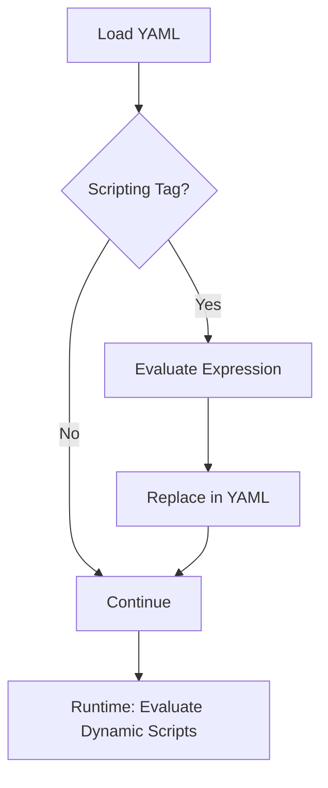

# Scripting

Inline scripting involves embedding and executing code directly within Godspeed YAML code (e.g. workflows, datasources, eventsource, events, etc.,) enhancing seamless integration of script-based logic or functionality.  
It is used directly by embedding the code/variables in `<% %>` tags. This code is evaluated whenever the yaml is needed to be evaluated e.g. at loadtime or runtime.

**Loadtime evaluation** There are some variables/code which should be evaluated at loadtime. For example, using [configs and mappings](../config-and-mappings/config.md) in datasources, events, or eventsources as given below:

```yaml title=src/datasources/api.yaml
type: axios
base_url: <% config.api.base_url %>
```

```yaml title=src/events/helloworld.yaml
"http.post./helloworld":
  fn: helloworld
  body:
    content:
      application/json:
        schema:
          type: object
          properties:
            name:
              type: string
            gender:
              type: string
              enum: <% mappings.gender %>
```

**Runtime evaluation** There are some variables/code which should be evaluated at runtime. For example, using [GSContext properties](../workflows/native-language-functions.md/#gscontext) in workflows as given below:

```yaml title=src/workflows/helloworld.yaml
id: helloworld
tasks:
  - id: first_task
    fn: com.gs.return
    args: <% "Hello, The gender of " + inputs.body.name + " is " + inputs.body.gender %>
```

## Default language at global level

The default language is `js`. You can change the default language globally in `defaults.lang` key in `config/default.yaml`. It will be applicable everywhere unless overridden explicitly.

```yaml title=config/default.yaml
defaults:
  lang: js #coffee
```

## Override the default language

You can override the default language by specifying the language inside the starting tag like `<coffee%` or `<js%`

```yaml
type: axios
base_url: <js% config.api.base_url %>
port: <coffee% config.port %>
```

## Scripting in datasources

Within datasources, [config or mappings](../config-and-mappings/config.md), can be accessed at loadtime.

```yaml title=src/datasources/api.yaml
type: axios
base_url: <% config.api.base_url %>
```

## Scripting in eventsources and events

Within datasources, you can use scripting as given in the below examples:

- accessing [config and mappings](../config-and-mappings/config.md).
- [authz instruction](../authorization/authz-usecases.md/#a-authorization-at-event-source-level)

```yaml title=eventsources/http.yaml
type: express
port: <% config.http.port %>
docs:
  endpoint: /api-docs
jwt:
  issuer: <% config.jwt.iss %>
  audience: <% config.jwt.aud %>
  secretOrKey: <%  config.jwt.sec %>
authz:
  - fn: com.gs.transform
    id: authz_task
    args: | # if this condition fails, the else gets executed
      <js% 
        if (inputs.user.role !== 'admin') { 
            return {
            success: false, 
            code: 403,
            message: "Authorization failed"
          }
        }
      %>
```

```yaml title=src/events/helloworld.yaml
"http.post./helloworld":
  fn: helloworld
  body:
    content:
      application/json:
        schema:
          type: object
          properties:
            name:
              type: string
            gender:
              type: string
              enum: <% mappings.gender %>
  authz:
    - fn: com.gs.transform
      id: authz_task
      args: | # if this condition fails, the else gets executed
        <js% 
          if (inputs.user.role !== 'system admin') { 
              return {
              success: false, 
              code: 403,
              message: "Authorization failed"
            }
          }
        %>
```

## Actionable Inline Scripting Examples

### Loadtime Scripting (Config/Mappings)

```yaml
type: axios
base_url: <% config.api.base_url %>
```

### Runtime Scripting (Workflow Logic)

```yaml
tasks:
  - id: greet
    fn: com.gs.return
    args: <% "Hello, " + inputs.body.name %>
```

### Dynamic Enum from Mappings

```yaml
body:
  content:
    application/json:
      schema:
        type: object
        properties:
          gender:
            type: string
            enum: <% mappings.gender %>
```

### TypeScript Scripting Example

```typescript
import { GSContext } from "@godspeedsystems/core";
export default function (ctx: GSContext) {
  const name = ctx.inputs.data.body.name;
  return `Hello, ${name}`;
}
```

## Troubleshooting & FAQ

- **Q: Scripting not evaluated?**
  - Check for correct `<% ... %>` syntax and language tag
- **Q: Config/mappings not available?**
  - Ensure referenced keys exist in config/mappings
- **Q: Runtime errors in script?**
  - Use simple, safe expressions and validate input types

## LLM Guidance & Prompt Templates

- **Prompt:** "Show a YAML example using inline scripting to concatenate two fields."
- **Prompt:** "Write a workflow that uses runtime scripting to transform input data."
- **Prompt:** "Generate a config that uses loadtime scripting for an API key."

## Best Practices & Anti-Patterns

**Best Practices:**

- Use scripting for dynamic values, not complex logic
- Prefer loadtime scripting for config/mappings
- Validate all script expressions for safety
- Document all dynamic fields

**Anti-Patterns:**

- Embedding business logic in scripts
- Overusing scripting for deeply nested logic
- Hardcoding secrets in scripts
- Skipping validation of script output

## Cross-links

- [Config](../config-and-mappings/config.md)
- [Workflows](../workflows/overview.md)
- [API & Event](../API%20&%20Event.md)
- [Datasources](../datasources/overview.md)

## Scripting Evaluation Flow Diagram



## Glossary

- **Inline Scripting:** Embedding code in YAML using `<% ... %>`
- **Loadtime Scripting:** Evaluated when config is loaded
- **Runtime Scripting:** Evaluated during workflow execution
- **Mappings:** Static key-value pairs for dynamic logic
- **GSContext:** Context object for script evaluation
