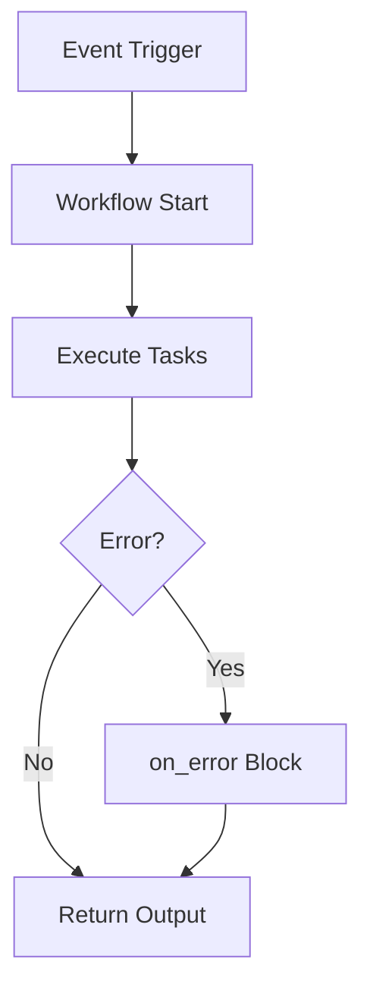
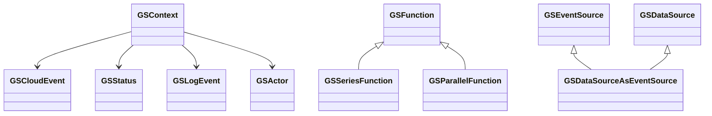

The Meta Framework allows you to write business logic in [Typescript and Javascript functions](/docs/microservices-framework/workflows/native-language-functions.md)
You may use any language depending on your choice. We suggest to prefer Typescript over Javascript for type check reasons.

### Video explanation of functions

<!-- <div style={{ margin: '20px auto', textAlign: 'center' }}>
  <iframe width="560" height="315" src="https://www.youtube.com/embed/66TxoXEPKUc" frameBorder="0" allowFullScreen></iframe>
</div> -->

<div style={{ position: 'relative', paddingBottom: '56.25%', height: 0, overflow: 'hidden' }}>
<iframe style={{ position: 'absolute', top: 0, left: 0, width: '100%', height: '100%' }} src="https://www.youtube.com/embed/E33GqpTr4iw?si=Er9oRp9L6YzH8EJt" frameborder="0" allowfullscreen></iframe>
</div>

### Writing functions

#### Typescript

```typescript
module.exports = function greet(GSContext: ctx) {
  return `Hello ${ctx.inputs.data.query.name}!`;
};
```

#### Javascript

```javascript
module.exports = function greet(ctx) {
  return `Hello ${ctx.inputs.data.query.name}!`;
};
```

---

## Actionable Workflow Examples

### Simple Workflow (YAML)

```yaml
id: greet_user
summary: Greet the user by name
tasks:
  - id: greet
    fn: com.gs.return
    args: <% "Hello, " + inputs.body.name %>
```

### Subworkflow Example

```yaml
id: parent_workflow
tasks:
  - id: call_sub
    fn: subworkflow.greet_user
    args:
      name: <% inputs.body.name %>
```

### Error Handling Example

```yaml
id: error_demo
tasks:
  - id: risky_task
    fn: com.gs.risky
    args: {}
on_error:
  continue: false
  response:
    success: false
    code: 500
    data: "Something went wrong"
```

### Parallel Tasks Example

```yaml
id: parallel_demo
tasks:
  - id: parallel
    fn: com.gs.parallel
    tasks:
      - id: task1
        fn: com.gs.return
        args: "A"
      - id: task2
        fn: com.gs.return
        args: "B"
```

### TypeScript Workflow Example

```typescript
import { GSContext, GSStatus } from "@godspeedsystems/core";
export default function (ctx: GSContext) {
  const { name } = ctx.inputs.data.body;
  return new GSStatus(true, 200, "OK", `Hello, ${name}`);
}
```

---

## Troubleshooting & FAQ

- **Q: Workflow not found?**
  - Ensure the workflow file is in `src/functions/` and named correctly
- **Q: Task output missing?**
  - Reference outputs by task ID: `outputs["task_id"]`
- **Q: Error handling not working?**
  - Add or correct the `on_error` block
- **Q: Subworkflow not executing?**
  - Use `fn: subworkflow.workflow_id` and ensure the subworkflow exists

---

## LLM Guidance & Prompt Templates

- **Prompt:** "Generate a Godspeed YAML workflow that fetches a user and returns their name."
- **Prompt:** "Write a workflow with parallel tasks and error handling."
- **Prompt:** "Convert this business logic to a Godspeed workflow."

---

## Best Practices & Anti-Patterns

**Best Practices:**

- Use descriptive IDs for tasks and workflows
- Keep workflows modular and reusable
- Always handle errors with `on_error`
- Use subworkflows for repeated logic
- Validate all input/output schemas

**Anti-Patterns:**

- Deeply nested or overly complex workflows
- Duplicating logic instead of using subworkflows
- Skipping error handling
- Hardcoding values instead of using inputs/outputs

---

## Cross-links

- [API & Event](../API%20&%20Event.md)
- [Datasources](../datasources/overview.md)
- [Plugins](../plugins/sample-configs.md)
- [Inline Scripting](../inline-scripting/overview.md)

---

## Workflow Execution Flow Diagram



---

## Glossary

- **Task:** A single step in a workflow
- **Subworkflow:** A workflow called from another workflow
- **on_error:** Error handling block
- **outputs:** Object containing results of previous tasks
- **GSContext:** Context object passed to all workflows
- **GSStatus:** Standard response/result object

---

# Core Classes & Patterns

## Key Classes and Interfaces

| Class/Interface             | Purpose/Role                            | Extends/Implements | Used By/For               |
| --------------------------- | --------------------------------------- | ------------------ | ------------------------- |
| `GSContext`                 | Execution context for all logic         | -                  | All functions, plugins    |
| `GSCloudEvent`              | Canonical event/request object          | -                  | `GSContext.inputs`        |
| `GSStatus`                  | Standard result/response object         | -                  | All logic, error handling |
| `GSFunction`                | Base for all executable units/workflows | `Function`         | Workflows, tasks          |
| `GSSeriesFunction`          | Sequential workflow                     | `GSFunction`       | YAML workflows            |
| `GSParallelFunction`        | Parallel workflow                       | `GSFunction`       | YAML workflows            |
| `GSEventSource`             | Abstract event source plugin            | -                  | Plugins                   |
| `GSDataSource`              | Abstract datasource plugin              | -                  | Plugins                   |
| `GSDataSourceAsEventSource` | Abstract for dual-role plugins          | -                  | Plugins                   |
| `GSActor`                   | User/system actor info                  | -                  | `GSCloudEvent.actor`      |
| `GSLogEvent`                | Structured log entry                    | -                  | `GSContext.log_events`    |

## Usage Patterns & Examples

### GSContext

```typescript
import { GSContext } from "@godspeedsystems/core";
export default function (ctx: GSContext) {
  ctx.logger.info("Inputs:", ctx.inputs);
  ctx.logger.info("Config:", ctx.config);
  ctx.logger.info("Datasources:", Object.keys(ctx.datasources));
}
```

### GSStatus

```typescript
import { GSStatus } from "@godspeedsystems/core";
return new GSStatus(true, 200, "Success", { data: "value" });
```

### GSFunction, GSSeriesFunction, GSParallelFunction

- Used internally for YAML/TS workflows; extend for custom execution patterns.

### GSActor

- Accessed via `ctx.inputs.actor` for user/system info.

### GSLogEvent

- Used for advanced logging and observability.

## Class Relationships Diagram



## Cross-links

- [Plugin Development Guide](../plugins/sample-configs.md)
- [Context Reference](../../context.md)
